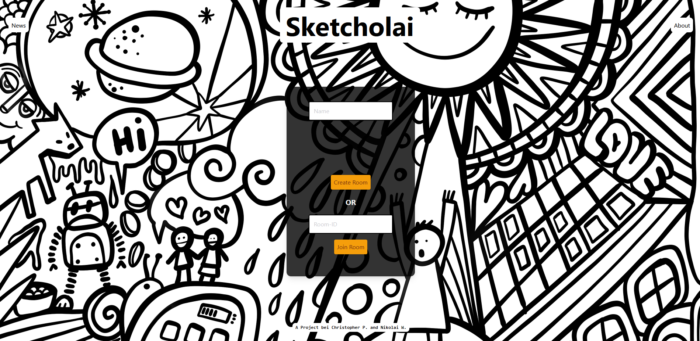
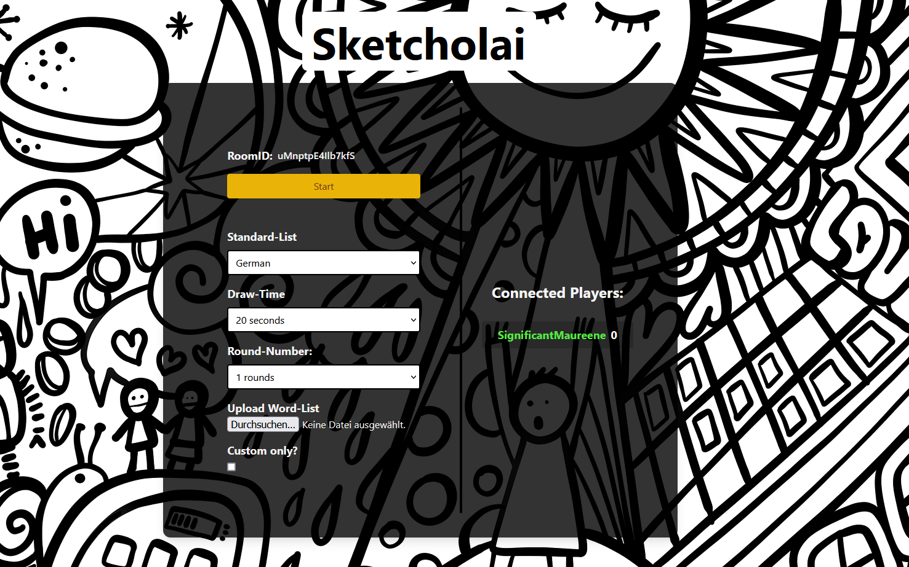
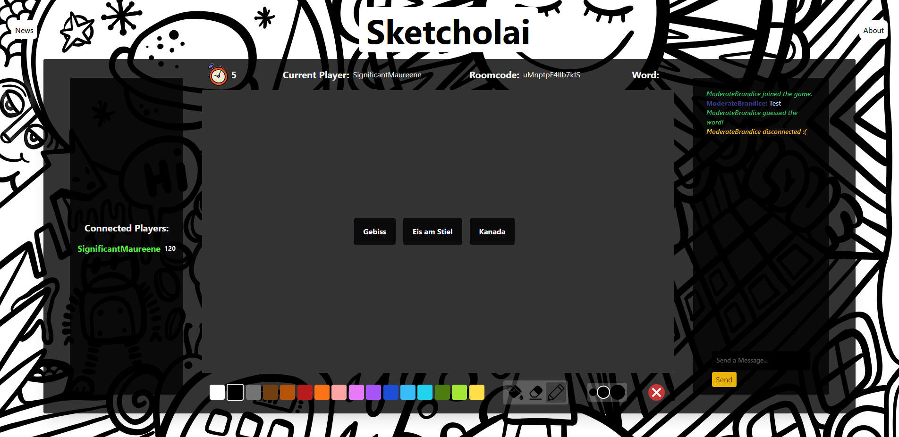

# sketcholai
## A multiplayer online drawing game

### Technical

An Express backend, written in Typescript and Node.js. Client-Server communication realized via the [socket.io](https://www.npmjs.com/package/socket.io) framework.
The frontend is written in plain Javascript, without any frontend framework.

### Screenshots

The Frontpage:

Create rooms and upload custom wordlists.

Play and have fun!

